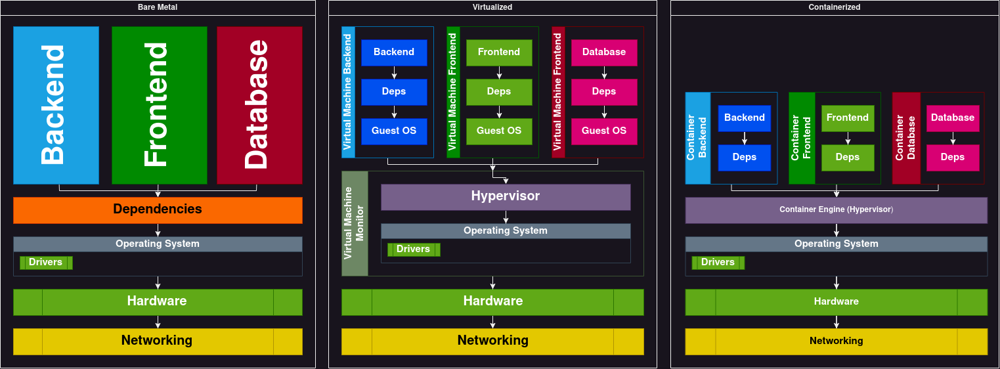

# IUT-Connect


Ce répertoire contient les sources officielles de la plateforme de gestion d'alternance IUT-Connect, permettant la recherche et le suivi d'alternance en ligne sous la forme d'une application web.
Elle vise à centraliser le processus de recherche d'alternance pour les étudiants ainsi que leur accompagnement pour les tuteurs, en plus de regrouper les offres d'entreprises.

* Aux entreprises de poster des offres d'alternances.

* Aux étudiants de consulter les offres des entreprises.

* Aux étudiants d'accéder à une liste des entreprises certifiées par l'IUT.

* Aux professeurs tuteurs de suivre les étudiants qui leur sont assignés.

* Aux professeurs de gérer les événements relatifs à l'alternance.

## Technologies & dépendances

### Système d'exploitation

Le système d'exploitation requis est Linux, de préférence Debian, pour que le script d'installation fonctionne sans nécessiter de modifications

### Virtualisation & conteneurisation

La virtualisation consiste à exécuter sur une machine hôte dans un environnement isolé, des systèmes d'exploitation (virtualisation système) ou des applications (virtualisation applicative ou conteneurisation), les plus gros avantages sont la maintenance et la sécurité :

* L'exécution se déroule dans un environnement isolé, ce qui permet un déploiement sécurisé et optimisé des ressources.

* La migration ou la mise à jour de la machine virtuelle est simplifiée sans affecter l'hôte ni la machine virtuelle.



Cependant, la virtualisation système exécute une copie complète d'un système d'exploitation, ce qui implique une surcharge supplémentaire par rapport aux conteneurs. Ces derniers partagent le même noyau que l'hôte, ce qui les rend plus légers et plus rapides. C'est pourquoi nous avons choisi d'utiliser les conteneurs.

Nous avons donc opté pour **Docker**, une plateforme permettant de lancer certaines applications dans des conteneurs logiciels. Pour gérer la virtualisation et le déploiement de la plateforme IUT-Connect.

### GNU make

GNU Make est un outil qui contrôle la compilation de fichiers exécutables ou la création de divers fichiers non sources à partir de ces fichiers source.
Make construit les fichiers grâce au **Makefile**, un fichier qui répertorie chacun des fichiers source et définit les règles permettant de les assembler.

### Wizards (Assistants d'installation)

Il y a deux types de Wizards, le premier est un **script shell** pour installer les dépendances, le second est un **Makefile** qui permet de générer et lancer les images et conteneurs docker.

### Backend


Le Back-end de la plateforme a été réalisé en **GoFiber** un cadriciel du langage **Go** ainsi que **PostegreSQL** comme système de gestion de bases de données, pour en assurer la persitance.

### Frontend


Le Front-end de la plateforme a été réalisé avec **shadcn/ui**, un corpus de composants réutilisables pour **Radix UI** et **Tailwind**, ainsi le cadriciel **Next.js** du langage **React.js** avec des pages **TypeScript** et un cadriciel CSS **TailWind**.

## Installation

La plateforme IUT-Connect dispose d'un installateur sous **make** permettant de facilement déployer l'application en seulement deux commandes et la modification d'un fichier de configuration .toml.

### Télécharger le projet

Vous pouvez télécharger le projet de trois manières différentes :

* En utilisant le bouton "Télécharger" pour obtenir une archive au format .zip ou .tar. L'avantage de cette méthode est qu'elle ne nécessite aucune identification.
* Depuis le bouton Cloner, avec un **protocole SSH**, en suivant cet [exemple](https://www.theserverside.com/blog/Coffee-Talk-Java-News-Stories-and-Opinions/github-clone-with-ssh-keys), l'avantage c'est la sécurité sans fournir ses informations d'identification à chaque requête, optimal pour le développement

```shell
git clone git@forgens.univ-ubs.fr:kerbelle/iut-connect.git
```

* Depuis le bouton Cloner, avec un **protocole HTTPS**, en suivant cet [exemple](https://learn.hibbittsdesign.org/gitlab-githubdesktop/cloning-a-gitlab-repo), l'avantage c'est la sécurité aux prix de finir ses informations d'identification à chaque requête.

```shell
git clone https://forgens.univ-ubs.fr/gitlab/kerbelle/iut-connect.git
```

### Assistant logiciel

Toute les commandes doivent être éxécuté à la racine du projet.

#### Wizard

Pour installer et configurer toutes les dépendances du projet comme **docker** facilement, un script shell est disponible à la racine du projet pour gérer l'installation avec Debian, Ubuntu ou du moins le gestionnaire de paquet apt et la commande lsb_release. **Merci d'inclure la liste des utillisateurs**.

```shell
sudo ./wizard.sh $USER1 $USER2 [...]
sudo ./wizard.sh $(whoami)
```

### Makefile

#### Déployer en une ligne

Toutes les étapes sont détaillées dans les sous-parties ci-dessous, cependant si vous voulez déployer la plateforme sans vous poser de questions :

```shell
make all
```

#### Afficher l'aide intégré

pour afficher l'aide intégrée, utiliser la commande ci-dessous :

```shell
make help
```

#### Générer le fichier d'environnement

Pour créer et configurer le fichier d'environnement, utiliser la commande ci-dessous à la racine du projet.

```shell
make env
```

#### Nettoyer le projet

Pour supprimer tout les fichiers temporaires / conteneurs / volumes du projet.

```shell
make clean
```

Pour supprimer tout le projet et ne laisser que les fichiers sources (comme quand vous l'avez téléchargé).

```shell
make purge
```

C'est une étape obligatoire et elle doit être répétée à chaque modification de l'environnement (changement de l'adresse ip, ...)

Pensez à modifier les variables des clés utilisées pour le cryptage de la base de données ou les ports utilisés pour éviter tout problème lors du déploiement.

#### [PROD] Déployer les conteneurs

Pour créer et démarrer les conteneurs docker, utilisez la commande ci-dessous à la racine du projet.

```shell
make compose
```

Il est possible de ne démarrer qu'un élément précis en précisant le nom du conteneur à démarrer avec la commande suivante :

```shell
make compose_<app>
```

* **dbms** : la base de données.

* **backend** : l'api qui fait le lien entre le client et la base de données.

* **frontend** : le client graphique utiliser par l'utilisateur.

#### [DEV] Déployer les conteneurs

Pour créer et démarrer les conteneurs docker, utilisez la commande ci-dessous à la racine du projet.

```shell
make build
```

Il est possible de ne démarrer qu'un élément précis en précisant le nom du conteneur à démarrer avec la commande suivante :

```shell
make build_<app>
```

* **dbms** : la base de données.

* **backend** : l'api qui fait le lien entre le client et la base de données.

* **frontend** : le client graphique utiliser par l'utilisateur.

### Maintenance

#### Restaurer la base de donnée

Il est possible de retrouver la base de donnée dans le volume Data à la racine du projet.

#### Diagnostiquer GNU Make

##### Pour consulter les fichiers de journalisation / environnement du projet depuis la racine du projet

```shell
cat ./env/iut-connect.log
cat ./env/iut-connect.toml
```

#### Diagnostiquer docker

##### Pour visualiser toutes les images

```shell
docker images -a
```

##### Pour visualiser tous les conteneurs et leurs statuts

```shell
docker ps -a
```

##### Pour visualiser tous les volumes

```shell
docker volume ls
```

##### Pour consulter le fichier de journalisation de docker

```shell
journalctl -xu docker.service
cat /var/log/syslog
cat /var/log/messages
```

##### Pour consulter les fichiers de journalisation des conteneurs

```shell
docker logs <name or id>
```

#### Utilliser Git

##### Instalation

```shell
apt install git
git config --global credential.helper store
git config --global user.email "alias@domain.extension" (facultatif)
git config --global user.name "alias" (facultatif)
```

Mettez y ce que vous voulez, vous utiliserez la clé ssh et n’en aurez pas besoin, la commande `git config --global credential.helper store` pour activer la saisie automatique (parfois la plateforme git peut être un oiseau embêtant au sujet des informations d’identification, donc vous pourriez en avoir besoin).

##### Crée un project

```shell
git init
git add README.md
git commit -m "first commit"
git branch -M master
git remote add origin git@git.com:User/ProjectName.git (gitHub format)
git push -u origin master
```

##### Cloner un project

```shell
git clone git@git.com:User/ProjectName.git (gitHub format)
cd ProjectName
git branch -M master
git push -u origin master
```

##### Mettre à jour la branche

Avec le makefile :

```shell
make update MSG="$TYPE : helpful insight about your work"
```

Sans le makefile :

```shell
git pull (pull = fetch + merge, to avoid conflict)
git add [FILES NAME] (--all for every changes)
git commit -m "$TYPE : helpful insight about your work"
git push
```

##### Pousser sur une autre branche

Avec le makefile :

```shell
make archvie BRANCH="$BRANCH" MSG="$TYPE : helpful insight about your work"
```

Sans le makefile :

```shell
git pull (pull = fetch + merge, to avoid conflict)
git add [FILES NAME] (--all for every changes)
git commit -m "$TYPE : helpful insight about your work"
git push

git checkout $BRANCH
git merge -X ours $ORIGIN
```

##### Recevoir d'une autre branche

```shell
git fetch origin $CURRENT:$ANOTER
```

##### Changer de Branch / créer un embranchement

```shell
git checkout -b $BRANCH (create the branch and switch to it)
```

##### Fusionne deux branches

```shell
git merge origin/$BRANCH
git branch -d $BRANCH (delete branche)
```

#### Utilliser docker

##### Pour créer une image depuis un dockerfile

```shell
docker build -t $NAME $EXEC_PATH -f $FILE

docker build -t hello-world . -f ./app/dockerfile
```

##### Pour lancer un contener depuis une image

```shell
docker run -p $HOST_IP:$HOST_PORT:$CONTAINER_PORT/$PROTOCOLE -d --restart unless-stopped --name $NAME $IMAGE

docker run -p 127.0.0.1:12000:80/tcp -d --restart unless-stopped --name hello-world-test hello-world
```

##### Pour publier une image sur Docker HUB

```shell
docker tag $NAME $USER/$NAME:$TAG
docker push $USER/$NAME:$TAG

docker tag hello-world ornsolot/hello-world:latest
docker push ornsolot/hello-world:latest
```

##### Pour utiliser un docker-compose.yml

```shell
docker compose up -df $FILE
docker compose up -df ./docker-compose.yml
```

#### Utilliser LXC

Les serveurs de l'IUT utillise un autre service de conteneurisation appeler LXC.
Pour tester la plateforme en condition réel voici la marche à suivre :

##### Installer LXC

```shell
export DOWNLOAD_KEYSERVER="hkp://keyserver.ubuntu.com"
sudo apt-get install lxc
```

##### Configuration des conteneurs

Rester sur un seul réseau lors de toute la configuration et du lancement du conteneur, sinon cela entraînerait des problèmes de configuration réseau nécessitant un reboot / reconfigurer le fichier de configuration du conteneur.

```shell
echo "$(id -un) veth lxcbr0 10" | sudo tee -a /etc/lxc/lxc-usernet
mkdir -p ~/.config/lxc
cp /etc/lxc/default.conf ~/.config/lxc/default.conf
MS_UID="$(grep "$(id -un)" /etc/subuid  | cut -d : -f 2)"
ME_UID="$(grep "$(id -un)" /etc/subuid  | cut -d : -f 3)"
MS_GID="$(grep "$(id -un)" /etc/subgid  | cut -d : -f 2)"
ME_GID="$(grep "$(id -un)" /etc/subgid  | cut -d : -f 3)"
echo "lxc.idmap = u 0 $MS_UID $ME_UID" >> ~/.config/lxc/default.conf
echo "lxc.idmap = g 0 $MS_GID $ME_GID" >> ~/.config/lxc/default.conf
sudo chmod +x /home/$USER/.local/share
```

Il faut également adapter votre config au modèle ci-dessous en plus de changer le DNS du conteneur à 8.8.8.8 (GOOLE).
Si des problèmes réseau persistent, contactez un professeur pour vous aider dans votre démarche.

```shell
code /home/$USER/.local/share/lxc/$CONTAINER/config

# Template used to create this container: /usr/share/lxc/templates/lxc-download

# Distribution configuration
lxc.include = /usr/share/lxc/config/common.conf
lxc.include = /usr/share/lxc/config/userns.conf
lxc.arch = linux64

# Container specific configuration
lxc.idmap = u 0 100000 65536
lxc.idmap = g 0 100000 65536
lxc.rootfs.path = dir:/home/ornsolot/.local/share/lxc/$CONTAINER/rootfs
lxc.uts.name = $CONTAINER
# lxc.apparmor.allow_nesting = 1
lxc.apparmor.profile = unconfined

# Network configuration
lxc.net.0.type = veth
lxc.net.0.flags = up
lxc.net.0.link = lxcbr0
lxc.net.0.name = eth0
# lxc.net.0.mtu = 1500
# lxc.net.0.hwaddr = 00:16:3e:de:19:91
lxc.net.0.veth.pair = v$CONTAINER
lxc.net.0.ipv4.address = 192.168.42.129/24
lxc.net.0.ipv4.gateway = auto
```

##### Créer un conteneur LXC

```shell
systemd-run --unit=my-unit --user --scope -p "Delegate=yes" -- lxc-start $CONTAINER
```

##### Démarer un conteneur LXC

```shell
lxc-start -n $CONTAINER
```

##### Attacher un conteneur LXC aux terminale

```shell
lxc-attach -n $CONTAINER
```

##### Arréter un conteneur LXC

```shell
lxc-stop -n $CONTAINER
```

##### Supprimer un conteneur LXC

```shell
lxc-destroy -n $CONTAINER
```

##### Redémarer un conteneur LXC

```shell
lxc-stop -n $CONTAINER
lxc-start -n $CONTAINER
```

##### Inspecter un conteneur LXC

```shell
lxc-info -n $CONTAINER
```

##### Inspecter tout les conteneurs LXC

```shell
lxc-ls -f
```
